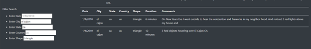

# UFO Sightings

In this module we were tasked with helping an aspiring UFO-ologist, Dana, in designing an interactive webpage for UFO sightings around the world. Users of the sight are able to
filter the results of the data by Date, Country, State, City, and even by shape of the aircraft. Dana hopes that by providing an easy and interactive way to sort through the data
will allow people to make their own informed decisions on the possibility of extraterrestrial life outside of our Solar System. 

# Results

The website opens with all 111 results being shown as a table near the bottom of the chart. One may be able to find the information they are searching for with the ctrl+F function
through the browser, although a built in feature would be much more useful, and allow visitors to filter by multiple fields. As seen below, results with multiple filters applied
are much more digestible. It is important to note that in the example that the lighter gray text is simply a placeholder value, and has no impact on the results.

# Summary

One major drawback to the current design is that the visitor must know the exact information that they are looking for, and that all results must be typed in lowercase characters.
This is contradictory to standard practices of capitalizing proper nouns, and may lead some to believe there are no sightings in their City/Country.

The first recommendation I would make is to add a snippet of code that converts the user input to all lowercase characters. One could acheive this by using the .toLowerCase()
function in Javascript, allowing the User to use any combination of capitalization and get the expected results. ADditionally a .trim() function could be added, getting rid of any
extra pesky whitespace at the beginning or end of the input.

The second reccomendation I would suggest is converting the filter for shape into a dropdown list with multiple values shown. Most of the other filters have a known set of values to choose from (i.e. State, there are only 50 States in the US), but the Shape category has a broader range of values, many of which an amateur UFO=ologist may not be entirely familiar with.  The drop down list will allow Users to take the data a step further and possibly even allow them to gain new and exciting insights into the world of little green men. 
